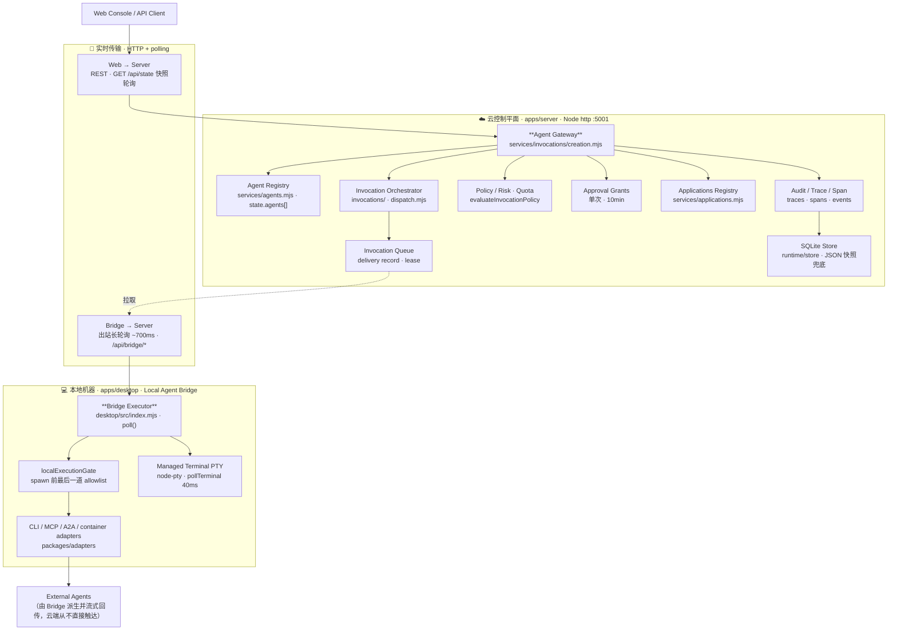
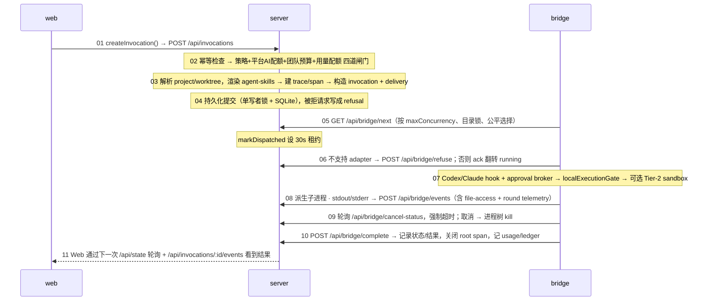

# myagenttool · 架构与工作流总览

> Agent Control Plane · 现状梳理 · 2026-07-18
>
> 依据 `README.md` / `DESIGN.md` / `docs/{vision,design,engineering}` 与运行时代码整理。
> 本页沿三条线一次梳理清楚：**产品运行时架构**、**AI 研发工作流**、**代码库组织**，
> 并在每处对齐「愿景蓝图 ↔ 实际落地」的差距。

---

## 0 · 全局：三层视角与一条主线

myagenttool 是一个面向个人与小团队的 **Agent 控制平面**——它不生产业务 Agent，而是
**管理、调用、审计并安全地暴露**已经存在的 Agent（`README.md` / `docs/vision/PRODUCT.md`）。
一句话定位：**注册 Agent、路由调用、强制权限、记录发生了什么。**

文档分三层，最终收敛到同一条产品主线：

| 层 | 位置 | 内容 |
|---|---|---|
| 愿景层 | `docs/vision` | 长期蓝图、M0–M4 路线图、状态机词汇 |
| 设计层 | `docs/design` + `DESIGN.md` | 产品流程 / IA / 治理设计、四类角色 |
| 工程层 | `docs/engineering` | 19 份 ADR、里程碑验收 |

**产品主线（Idea → Outcome）：**

```text
用户登录 → Bridge 上线 → 注册 Agent → Web 发起任务
        → 预运行审查 → 本地执行 → 日志/结果回流 → 审计留痕
```

> ⚠️ **读前须知 · 蓝图 vs 落地**
> 愿景文档描绘的是很大的长期系统（AI 计量计费、集成生成器、平台 Agent、市场分发）。
> **M0 只实现远程调用闭环**，后续里程碑逐步展开。本页以「已落地 / 规划中」标注，避免把蓝图当现状。
> 最大的现实差距：**产品尚无可部署产物**——server/web/desktop 仍是本地 demo 形态。

**图例：** 🟩 关键路径/Gateway · 🟦 传输/数据流 · 🟧 治理/审批闸门 · 🟢 已验收/健康 · 🟥 拒绝/阻断

---

## 1 · 产品运行时架构

核心切分：**云控制平面拥有身份、注册表、路由、策略、审计；本地 Bridge 拥有本地 Agent 访问与最终执行**。
安全模型的关键——连接云端控制与本地机器，**但不给云端直接控制机器的能力**：
Bridge 只做**出站**连接，Server 永不回拨本地。



> ⚠️ **现状差距 · 传输层**
> **ADR‑0002 选定 WebSocket** 作为 Server↔Bridge 实时基线，但当前实现是 **HTTP 轮询**顶替
> （span 自标 `polling-demo-websocket-baseline`）。架构语义（拉取式、出站、租约重投递）已到位，
> realtime channel 是待补的实现细节。

### 核心子系统定位（README 命名 ↔ 代码落点）

| 子系统 | 职责 | 关键落点 |
|---|---|---|
| **Agent Registry** | 注册与存储 Agent；按 adapter 类型走工厂，按 id upsert | `services/agents.mjs` · `routes/agents.mjs` · `protocol/agent.ts` |
| **Agent Gateway** | 统一调用入口；所有调用无论 adapter/位置都汇入 `createInvocation()` | `services/invocations/creation.mjs` · `POST /api/invocations` |
| **Local Agent Bridge** | 机器侧执行者；出站长轮询，token 即设备身份 | `desktop/src/index.mjs` · `routes/bridge.mjs` · `runtime/bridge-auth.mjs` |
| **Bridge Liveness & Refusal** | 存活探测；`refuse` 动词让 Bridge 诚实拒绝（refusal ≠ failure） | `protocol/refusal.ts` · `docs/design/BRIDGE_LIVENESS_AND_REFUSAL.md` |
| **Applications Registry** | 受治理的外部工具（git/ccusage/gmail），descriptor 不可变 | `services/applications.mjs` · ADR 0007–0010 |
| **Web Console** | 操作面 React SPA；每个控制平面概念一个 feature | `apps/web/src/` · `lib/api-client.ts` |

- **Registry 种子**：demo CLI、Codex、Claude + 3 个 platform agent（troubleshooter / integration builder / application control）。
- **Gateway 分流**：平台/HTTP Agent 直接在 server 内跑（`runsWithoutBridge()`）；Bridge Agent 入派发队列。
- **Bridge 身份**：`POST /api/bridge/register` 换取**按设备 bearer 凭证**；每个 bridge 操作按凭证解析设备并做归属校验，而非全局 `state.device` 别名。

---

## 2 · 端到端调用链

一次 Bridge 型 Agent 调用从 Web 发起到审计留痕的真实时序（编号即执行次序）：



- 初始状态：`queued`（Bridge）/ `running`（直连）/ `waiting_for_local_approval`（高风险）。
- `RUNNABLE_ADAPTER_TYPES = cli · mcp · a2a · container`。
- delivery 状态机：`queued → dispatching → acknowledged → complete`。

---

## 3 · 数据模型

权威云端状态是内存中单一 `state` 对象（**~80 个集合**），提交时镜像到 SQLite。
`runtime/state-factory.mjs` 的 `createServerState()` 就是这份 schema。按域归组：

| 域 | 主要集合 |
|---|---|
| Agents | `agents[]`（adapter 联合类型、location、capabilities、economics、lifecycle、health） |
| Applications | `applications[]` · `installRuns` · `recoveryActions` · `results` · `dailyStats` |
| Invocations | `invocations[]` · `compareRuns` · `events` · `traces` · `spans` · `rounds` · `runTranscripts` |
| Devices | `devices[]`（`state.device` = `devices[0]` 别名）· `sshTargets` · `terminalSessions` |
| Quotas / Economics | `quotaPolicies` · `budgets` · `budgetReservations` · `aiUsageRecords` · `ledgerEntries` |
| Approvals | `approvalRequests` · `policyDecisionRecords` · **`approvalGrants`**（单次令牌）· `codexApprovalBrokerRequests` |
| Refusals / Audit | `refusals` · `refusalDailyStats` · `auditSummaries` · `auditExportRequests` · `eventHistoryRetention` |
| Users / Teams | `users` · `teams` · `tokens`（会话）· `ownerUserId` / `teamId` 作用域 |
| Projects / Worktrees | `projects` · `projectTargets` · `worktrees` · `worktreeReviews` · `autoRuns` · `deployments` · `issueClaims` |
| Integrations / Lifecycle | `discoveryRuns` · `integrationArtifacts` · `lifecycleRecipes/QueuedActions/RollbackRequests` · `privateCatalogEntries` · `signedBundleManifests` |
| Channels | `channels` · `channelIdentities` · `channelConversations` · `channelDeliveries` · `channelEvents` |
| Codex / Claude 治理 | `codexSessions` · `codexWorkspaces` · `codexEvidenceRecords` · `codexHookEvents` · `claudeApplyAuthorizations` · `*ReviewFindings` |

### 调用生命周期状态机（四类状态分离 · `STATE_MACHINE.md`）

核心设计：**不把业务状态、传输状态、取消状态、数据治理状态塞进同一个字段。**

```text
Invocation.status（用户可见的整体结果）
  created → authorized → queued → running → succeeded
                     ↘ waiting_for_local_approval   ↘ rejected / failed / cancelled

Invocation.delivery.state（传输是否可靠送达）
  queued → dispatching → acknowledged → complete
        ↘ redelivering / refused / exhausted / not_required

Refusal 分类（按顺序求值 · refusal.ts）
  not_granted → policy → state → human
  「refusal ≠ failure」：不肯试 vs 试了没成
```

---

## 4 · AI 研发工作流水线

这是**产品之外**的另一套系统：一条无依赖的 Node CLI（`tools/ai/src/index.mjs`），
把 idea→PR 全流程做成可编排、可审计、可断点续跑的命令。所有 `pnpm ai:*` 脚本都路由到它，
状态落在 git‑ignored 的 `.myagenttool/`。

```text
Idea → Clarification → Spec → Issue → ADR/Risk → Plan → Branch
     → Code → Tests → PR → Review → Merge → Release → Feedback
```

| 阶段 | 命令 | 说明 |
|---|---|---|
| 意图 · Intake & PM | `ai:intake` · `ai:pm` · `ai:feedback` | 问题陈述+验收草案 / PM brief（模型）/ 反馈转 issue |
| 拆分 · Issue | `ai:issue-tree` | 展开受治理 issue 树；高风险项须 `--human-approved` |
| 计划 · Plan | `ai:branch` · `ai:code-plan` · `ai:manifest` | 确定性分支名 / 实现计划（模型）/ work manifest |
| 闸门 · Scope & Test | `ai:scope-check` · `ai:testing-plan` | 计划 vs 实际 diff / 按变更×风险定证据 |
| 执行 · Run Work | `ai:run-work` | 编排器：跑 trusted coding adapter，默认 dry-run，`--apply` 落地 |
| 复核 · Review | `ai:review` | findings-first PR 评审，`--comment` 回帖 |
| 合并 · Promote → Merge | worktree 提升链 | 逐步人工 gate 到合并（见 §5） |
| 回路 · Release & Eval | `tools/release` · `ai:eval-heldout` | 发布 / 能力回归评测 |

> 相关文档：`docs/engineering/AI_DEVELOPMENT_WORKFLOW.md` · `FULL_FLOW_AI_DELIVERY.md` · `LOOP_ENGINE.md` · `LOOP_ROUTINES.md`

---

## 5 · Loop 引擎：队列 · 闸门 · Worktree 提升

一个 **loop** = 一次已登记的工作运行（一次实现尝试），有 run-id、append-only 事件日志、
证据文件与状态机——必须**可见、可续、可取消、可审计**。
核心模块 `tools/ai/src/loop/registry.mjs` 同时承载状态机、事件日志、注册表投影、锁、
队列/租约/心跳/超时、人工闸门。

### Loop 运行状态（`LOOP_RUN_STATES`）

```text
正常推进  created → planning → planned → applying → running_adapter → checking_scope → verifying
控制状态  awaiting_human · queued · claimed
终态      completed · failed · cancelled · timed_out
```

| 机制 | 说明 |
|---|---|
| **队列 + 租约调度**（本地无守护） | `enqueue`（planned→queued 带优先级）→ `claim`（注册表锁下原子领取，设 workerId + 60s 租约）→ `heartbeat` 续租 → `release` 归还 → `timeout-check` 判 `timed_out` |
| **人工审批闸门**（first-class 数据） | gate 有 gateId/state/reason/risk/scope；状态 `none/requested/approved/rejected/expired`；批准后回到 `planned`。高风险类别（安全/数据、计费、本地执行、发布、路线图）触发 |
| **Worker 执行器**（`loop-worker-once`，非守护） | 领一个队列 run 记证据。`mock` 验证控制回路；`child-run` 派生子 `run-work`（父拥队列/租约，子拥实现证据）；`--isolate-worktree` 在隔离 worktree 里跑，不碰当前工作区 |
| **Loop Routines**（loop 之上） | `spec → plan → routine-run 证据 → findings → loop runs`；fanout 把批准的 findings 转成普通 planned loop run，证据独立存于 `.myagenttool/routine-runs/` |

### Worktree 提升链（人工逐步 gate · 每步只写证据不越级）

把隔离 worktree 的改动送进已合并 PR 的多步链条——刻意拆碎，每步需显式 `--approval` 与
confirm-token，且**不修改父工作区**：

```text
promote → promotion-apply → promotion-verify → pr-prep → promotion-commit
        → push-plan → preflight → push-execute      ← 首个改变远端状态的步骤
        → pr-create-prep → execute
        → pr-merge-prep → execute（squash / merge / rebase）
```

每步都发 `loop_worktree_promotion_*` 事件。

### 状态存储（`.myagenttool/`）

```text
runs/registry.json         注册表投影（可从事件日志重建）
runs/registry.lock         守护每次变更的咨询锁（atomic temp+rename）
runs/<run-id>/events.jsonl  append-only 事件日志（真源）
runs/<run-id>/*             manifest · code-plan · testing-plan · scope-check · verification · worker-* · promotion-*
worktrees/                 隔离 git worktree（child-apply / 集成 / 提升分支）
routines/ · routine-runs/   routine spec 与运行证据
feedback/inbox.jsonl · evals/<run-id>/   反馈队列 · 评测证据
```

---

## 6 · 代码库组织

pnpm workspace，三段清晰边界：**apps**（可运行进程）、**packages**（共享契约与适配器）、
**tools**（研发/运维 CLI）。运行时是 `.mjs`（Node，无构建步骤），`.ts` 是类型契约与 React 应用。

### apps · 可运行进程

| 目录 | 定位 | 关键文件 |
|---|---|---|
| `apps/server` | 云控制平面 · 权威大脑（全部状态、注册表、派发队列、策略/经济/拒绝、REST 面；~50 service 工厂经 composer 注入，~15 后台 sweep 定时器） | `src/index.mjs` · `runtime/service-composer.mjs` · `runtime/state-factory.mjs` |
| `apps/desktop` | Local Agent Bridge · 唯一被允许派生本地 Agent 的进程（~2960 行，依赖 node-pty） | `src/index.mjs` · `local-execution-policy.mjs` |
| `apps/web` | Web Console · React SPA「冷静的任务指挥台」（`public/app/*.js` 是被取代的旧版纯 JS） | `src/main.tsx` · `src/lib/api-client.ts` |

### packages · 共享契约

| 目录 | 定位 | 关键文件 |
|---|---|---|
| `packages/protocol` | 线上/数据契约：类型（.ts）+ 运行时镜像（.mjs 带自检断言） | `src/{agent,invocation,device,refusal}.ts` |
| `packages/adapters` | MCP/A2A/container 的 normalize + 契约描述符，server（登记）与 desktop（执行）共用；CLI/HTTP 内联在两端 | `src/{mcp,a2a,container}.mjs` |
| `packages/shared` | 工具占位，目前极简（仅 index），预留的共享工具位 | `src/index.mjs` |

### tools · 研发/运维 CLI

| 目录 | 定位 |
|---|---|
| `tools/ai` | AI 交付工具链核心：命令路由 + Loop 引擎 + legacy 交付命令 + evals（见 §4/§5） |
| `tools/agents` | 外部 Agent 包装器（trusted adapter）：claude-apply / codex-exec / *-review / ccusage / application |
| `tools/dev` | 本地 demo（`run-local-demo.mjs`）+ ~90 冒烟测试 |
| `tools/{release,docs,github,mail-mcp,deploy}` | 发布候选检查/回顾 · 链接校验 · 邮件通道 · deploy（目前仅 docs 预览） |

---

## 7 · 治理不变量 · 里程碑 · ADR

整个系统由一组反复出现的**治理不变量**约束——它们同时体现在产品运行时与研发工作流两套系统里。

- **自主性永不越过审批闸门**：健康探测与自动恢复只能向安全方向**降级**，绝不重新启用执行。（最核心的不变量）
- **Approval Grant 单次·限定动作·10min 过期**：取代易泄漏的自由文本 token；意图绑定、单次、可过期、有决策记录；系统 actor 永不能铸造 grant；失败即**关闭**（fail closed）。
- **自动降级绝不自动上线**：连续 2 次源存在性检查失败 → active 转 offline；但 auto-online 会重新启用执行，故永远人工把关。
- **邮件正文永远是数据不是指令**：每一跳都 fenced verbatim，无 LLM 读原始正文；**send 是唯一的外泄边界，永不自动化**。
- **控制平面永不经手外部密钥**：授权是「就绪」而非能力；写凭证是受审的例外类；默认只读；Linux 提权是 per-action、不缓存的 polkit broker。
- **managed 证据与 imported 证据可见分离**：事后导入的证据永久标 `imported_after_the_fact`，可补充但绝不提升为 managed 证明。

### 里程碑状态（`MILESTONES.md` · `*_ACCEPTANCE_CLOSEOUT.md`）

| 里程碑 | 内容 | 状态 |
|---|---|---|
| **M0** 远程调用闭环 | 登录→Bridge 上线→注册 Agent→Web 调用→本地执行→日志/结果/审计/取消/离线队列 | ✅ 已验收 |
| **M1** 本地 Agent 管理 | 发现、启停、健康检查、高风险本地审批、角色模型、风险标签、BYOK AI、首个平台 Agent | ✅ 已验收 |
| **M2** 集成生成器与治理 | 意图→配置、生成 adapter/schema/tests、评审工作流、配额、用量/成本报告 | ✅ 已验收 |
| **M3** 生命周期自动化与计费 | 受治理生命周期 recipe、配额/账本/计费骨架、MCP/A2A/container adapter、chargeback | ✅ 已验收* |
| **M4** 市场与生态 | 公开扩展市场、payout、provider 结算、信任历史 | ⬜ 规划中 |

> ⚠️ **v0.1.0 · 现状定位**
> 首个版本标签，产品自述处于 **M2/M3 时代**。**关键限制：尚无可部署产物**——
> server/web/desktop 仍是本地 demo（M0 闭环形态），deploy 目标目前只有 docs 预览。
> DORA 的变更失败率/恢复时长在有真实部署目标前无法度量。v0.1.0 是一次**工具链/CI/评测治理**发布，
> 而非运行时变更。另有一条「AI 交付操作系统」成熟度轨（L0–L6）叠加在产品里程碑之上。

### 架构决策记录（`docs/engineering/ADR_INDEX.md`）

| ADR | 标题 | 决策 |
|---|---|---|
| 0001 | Local Dev Stack | TypeScript monorepo + pnpm workspaces |
| 0002 | Realtime Transport | 选定 WebSocket 为 Server↔Bridge 基线（实现暂用轮询顶替） |
| 0003 | Desktop Bridge Runtime | Node.js CLI/service 式 Bridge，平台差异藏在小服务边界后 |
| 0004 | Server Storage & Queue | 关系型持久化边界 + DB 队列表（M0 实为 JSON 文件态落地） |
| 0005 | Web Console Shell | 聚焦 M0 闭环的简单 web shell |
| 0006 | Codex Sandbox Default | read-only 为默认；可写执行是显式受治理 opt-in |
| 0007 | ccusage as Application | 把 ccusage 建模为 npm 源 Application，六份报告投影为能力 |
| 0008 | Registration Boundary | 可执行 Application 仅平台随附；用户只能注册非可执行 |
| 0009 | Descriptor Immutable | descriptor 注册后不可变，改动即重新注册 |
| 0010 | External Credential Readiness | 外部授权是「就绪」非能力；控制平面永不经手密钥 |
| 0011 | Mail Untrusted Input | 邮件正文永远是数据；send 是外泄边界，永不自动化 |
| 0012 | Channel Boundary | Channel 是受治理会话边界；回调网关独立监听，隔离控制平面 |
| 0013 | Channel Providers Pluggable | provider = readiness + inbound + outbound 三件事，其余共享 |
| 0014 | Write-Credential Application | 写凭证只能由独立的写凭证 Application 声明，是受审例外 |
| 0015 | Linux Elevation Broker | 提权经 polkit/pkexec 逐动作 broker，绝不缓存 |
| 0016 | Terminal Grade | grade 是派生读模型；finalStatus 是附加列，不替换 status |
| 0017 | OTLP Trace Export | 手写零依赖、opt-in 的 OTLP/HTTP JSON 导出，不引 OTel SDK |
| 0018 | Observability Deletion | 按主体删除内容；屏蔽的计费/审计证据留档仅脱敏 |
| 0019 | Observability History Table | 可观测历史独立 SQLite history 表，JSONL 为降级兜底 |

---

*本文件基于三条线（运行时代码 / AI 研发工具链 / 设计与 ADR 文档）的交叉梳理生成，
可随架构演进增量更新。锚点文件见各章表格。*
