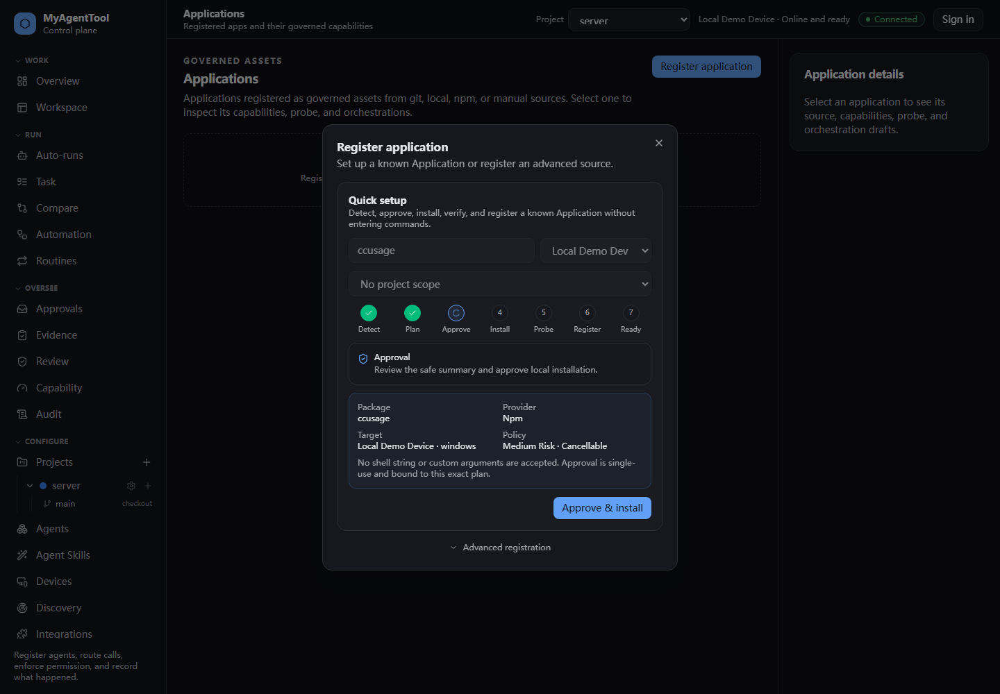
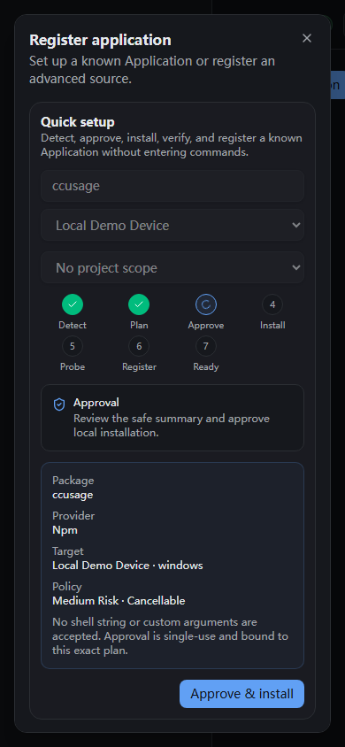

# Application installation progress Visual QA

## Desktop — 1440px

## Narrow — 390px

Verified behavior:

- The governed setup sequence is visible as Detect, Plan, Approve, Install,
  Probe, Register, and Ready.
- The approval view shows only package, provider, target, risk, and cancellation
  policy; executable paths and argv are not rendered.
- The primary approval action remains visible without horizontal scrolling at
  390px.
- Advanced registration remains available below the governed setup card.
- The dialog scrolls vertically when its content exceeds the viewport.
