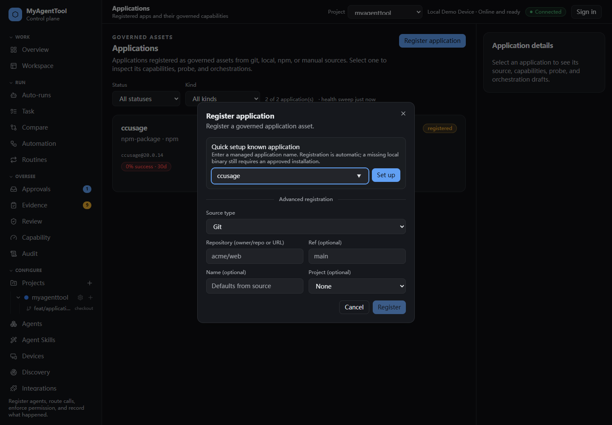

# Application quick registration visual QA

## 1440px desktop

Verified behavior:

- The quick setup field is the first action in the existing registration dialog.
- `ccusage` is presented as a known application name without exposing wrapper argv or executable paths.
- The advanced git, local, npm, and manual registration flow remains available below the quick path.
- The dialog explains that registration is automatic while missing binaries still require an approved installation.
