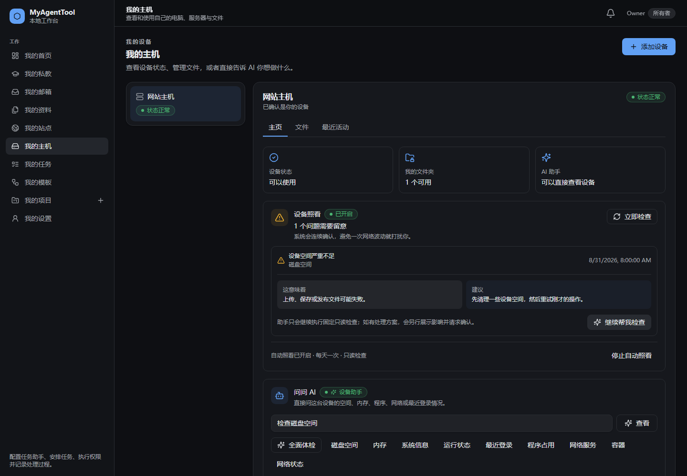
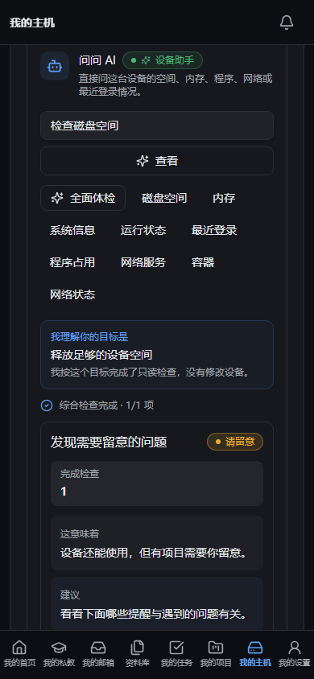

# My Hosts incident guidance visual QA

Captured from the real Vite console with the deterministic ordinary-user host
fixture in `apps/web/e2e/my-hosts-ordinary.spec.ts`.

## Desktop — 1440 px

## Mobile — 390 px

Verified behavior:

- The newest open health incident is expanded and explains what happened, its
  impact, and the recommended next step.
- “Continue checking” routes the incident to a matching fixed read-only
  diagnosis; it does not expose a cleanup, restart, or arbitrary-command action.
- The device assistant repeats the understood outcome and explicitly says the
  device was not modified.
- Raw SSH commands and output are absent in ordinary mode.
- The owner flow remains readable without horizontal overflow at 390 px.
