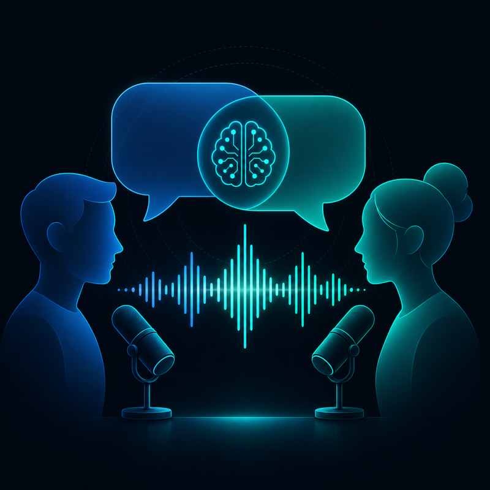

我是偶然试到 ListenHub 的。

当时找一个能把文章转成播客的工具，之前用过几个，基本是 TTS——机器在念稿，听两分钟就关了。ListenHub 不一样，它出来的是两个人在辩论这篇文章的核心观点。有立场，有质疑，有来回。

听完我往下翻了翻，发现它能做的不只是播客。

---

## 01一个输入，多种产出

ListenHub 的定位是：把任何内容变成任何格式。

输入可以是文章链接、PDF、视频 URL，甚至一个主题词，它负责解析内容、生成脚本、配音、剪辑，几分钟出一个成品。

能出的格式：

**播客**：单人讲述、双人对话、辩论三种格式。辩论格式我觉得最有意思——不是朗读，而是两个角色针对文章内容的争论，节奏和真实播客接近。

**Storybook**：把主题或文字变成动画故事书，AI 生成角色设计，前后保持一致，配情绪化配音，导出可以直接发小红书或 TikTok 的视频。看到这个功能的时候有点惊艳——一分钟出带插图的故事，角色不乱跳。

**Explainer Video**：解说视频，自动生成画面加旁白，适合产品介绍或概念讲解。

**幻灯片**：结构化 PPT，风格从极简到赛博朋克都有。

**Creator**：专门针对微信/小红书的内容格式，自动配图。

还有一个 **Content Parser**，把 YouTube 视频、PDF、推文丢进去，提炼结构化内容。作为情报预处理工具，这块我用得也不少。

---

## 02为什么它的下限比较高

大多数 AI 工具给你能力，你自己拼出结果——质量好不好，很大程度取决于你 Prompt 写得怎么样。

ListenHub 走的路不同。它把"怎么做一个有节奏的播客"、"怎么写一个前后连贯的故事"这些判断，预先打包进了生产流程。你不需要懂脚本结构，平台替你做了这些决定。

结果是输入质量决定上限，下限被拉得很高。一个从没做过内容的人，扔进去一篇文章，也能出来一个听得进去的播客。

---

## 03没解决的

内容有套路感。辩论格式的结构模板是固定的：铺背景、提观点、质疑、收尾。听多了会腻，但对快速生产内容来说够用。

Voice Cloning 克隆出来的声音在情绪化表达上有失真——信息载体够用，作为个人品牌的声音还差一点。

中文内容处理质量比英文稍弱，断句和重音偶尔有问题。

---

工具：ListenHub https://listenhub.ai/?aff=4e45f6eb7b46401f
